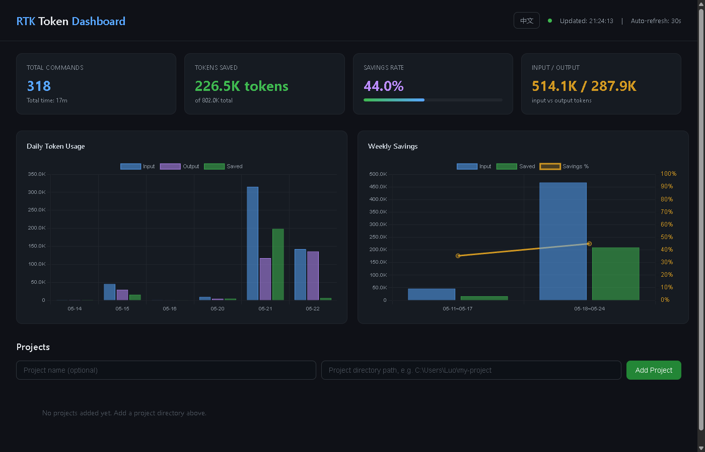

# RTK Dashboard

> RTK saves you 40-60% on tokens. This dashboard shows you exactly how — in real-time, per-project, with charts.

A real-time visualization dashboard for [RTK (Rust Token Killer)](https://github.com/anthropics/rtk). Track every token saved across all your projects.



## Why?

RTK silently saves you thousands of tokens every session. But you never *see* it. This dashboard makes the savings visible — daily trends, per-project breakdowns, command-level efficiency. Know exactly where your tokens go and how much RTK catches.

## Features

- **Real-time stats** — Commands, tokens saved, savings rate, input/output ratio
- **Daily & weekly charts** — Bar charts with savings trend lines
- **Per-project monitoring** — Add any project directory, see its RTK stats instantly
- **Bilingual** — English & Chinese, one-click toggle
- **30s auto-refresh** — Always up to date
- **Zero config** — Two files, one command, done

## Quick Start

```bash
pip install flask
python rtk_dashboard.py
# Open http://localhost:5678
```

## Deploy

Copy `rtk_dashboard.py` + `dashboard.html` to any machine with Python 3.8+ and RTK. That's it.

<details>
<summary>One-click start scripts</summary>

**Windows:** Double-click `start.bat`

**Mac/Linux:** `bash start.sh`
</details>

<details>
<summary>Docker</summary>

```bash
docker build -t rtk-dashboard .
docker run -d -p 5678:5678 rtk-dashboard
```
</details>

## API

| Endpoint | Method | Description |
|---|---|---|
| `/` | GET | Dashboard UI |
| `/api/global` | GET | Global stats |
| `/api/projects` | GET/POST/DELETE | Manage projects |
| `/api/project?path=...` | GET | Per-project stats |

## License

MIT
