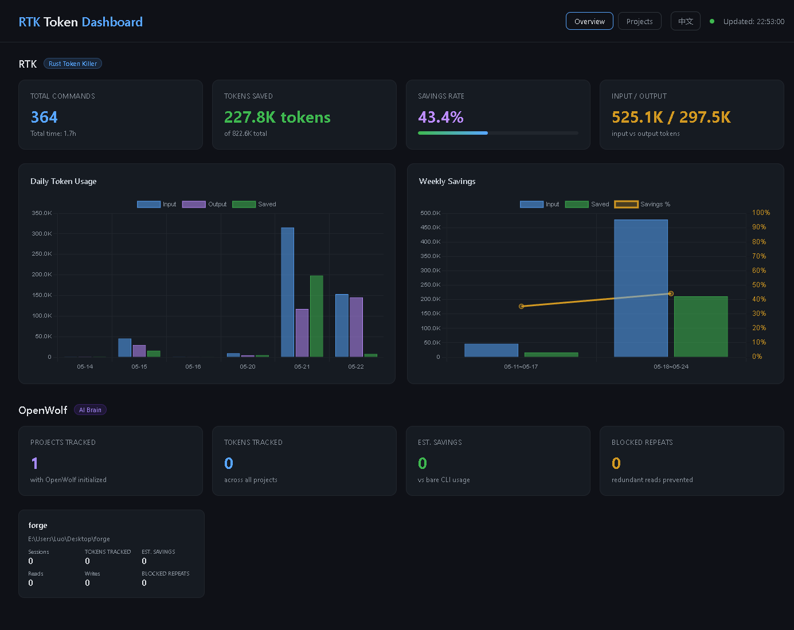
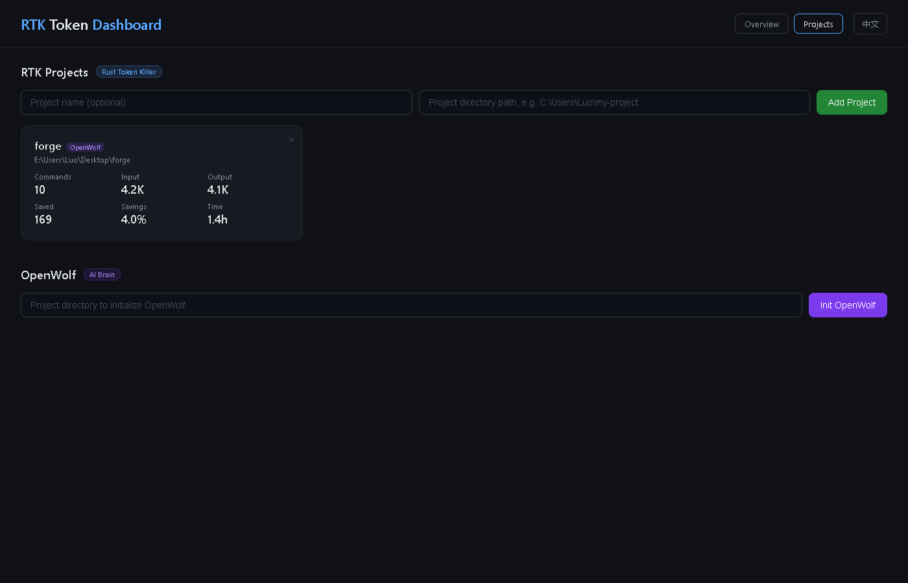

# RTK Dashboard

[中文文档](#中文文档) | [English](#english)

---

## English

A real-time web dashboard for monitoring **RTK** and **OpenWolf** token savings across all your projects.





### What is this?

When you use Claude Code, RTK runs as a background hook that intercepts CLI command output (git, ls, cat, etc.) and compresses it before sending to Claude — saving 40-90% of tokens per command. OpenWolf adds a persistent memory layer on top of that.

**This dashboard** visualizes exactly how many tokens you've saved, per project, with charts and breakdowns. You get a clear picture of where your tokens go and how much RTK catches.

### What do you need?

| Dependency | What it is | Required? | Install |
|---|---|---|---|
| **Python 3.8+** | Runs the dashboard server | Yes | [python.org](https://python.org) |
| **Flask** | Python web framework | Yes | `pip install flask` |
| **RTK** | Token-saving CLI proxy for Claude Code | Yes | `cargo install rtk` or see [RTK repo](https://github.com/anthropics/rtk) |
| **OpenWolf** | Persistent AI memory layer for Claude Code | Optional | `npm install -g openwolf` |
| **Node.js 16+** | Required by OpenWolf | Only if using OpenWolf | [nodejs.org](https://nodejs.org) |

### How does it work?

```
Claude Code  →  RTK (hook)  →  Real CLI commands
      ↓
  Token savings logged to rtk gain
      ↓
  Dashboard reads via rtk gain -a -f json
```

1. RTK runs as a Claude Code hook, intercepting and compressing command output
2. RTK logs token usage per command, per project
3. This dashboard queries RTK's data via `rtk gain -a -f json` and displays it in real-time

OpenWolf adds a `.wolf/` directory to each project that tracks file reads/writes and prevents redundant reads — its ledger is read directly by the dashboard.

### Local Setup

**1. Install RTK**

```bash
# Verify RTK is installed
rtk --version
rtk gain  # Should show savings data, not "command not found"
```

If `rtk gain` fails, you may have a name collision with another package called `rtk` (Rust Type Kit). Uninstall it first.

**2. Install dependencies**

```bash
pip install flask
```

**3. Start the dashboard**

```bash
python rtk_dashboard.py
# Or use the one-click scripts:
#   Windows: double-click start.bat
#   Mac/Linux: bash start.sh
```

**4. Open in browser**

```
http://localhost:5678
```

**5. Add your projects**

Go to the Projects page, paste your project directory path, and click "Add Project". RTK stats will appear immediately.

**6. (Optional) Initialize OpenWolf**

On the Projects page, enter a project path and click "Init OpenWolf". This adds persistent memory to that project for Claude Code sessions.

### Pages

| Page | URL | What it shows |
|---|---|---|
| **Overview** | `/` | Global RTK stats, daily/weekly charts, OpenWolf summary |
| **Projects** | `/projects` | Add/remove projects, per-project RTK stats, OpenWolf init |

### API Endpoints

| Endpoint | Method | Description |
|---|---|---|
| `/api/global` | GET | Global RTK stats (`rtk gain -a -f json`) |
| `/api/global/quota` | GET | Quota projection (`rtk gain -q -f json -t 20x`) |
| `/api/projects` | GET | List saved projects |
| `/api/projects` | POST | Add project (body: `{path, name}`) |
| `/api/projects` | DELETE | Remove project (body: `{path}`) |
| `/api/project?path=...` | GET | Per-project RTK stats |
| `/api/openwolf/init` | POST | Initialize OpenWolf (body: `{path}`) |
| `/api/openwolf/status?path=...` | GET | OpenWolf status and ledger data |

### File Structure

```
rtk-dashboard/
├── rtk_dashboard.py    # Flask backend (API + static file serving)
├── dashboard.html      # Overview page (charts, stats)
├── projects.html       # Project management page
├── start.bat           # Windows one-click launcher
├── start.sh            # Mac/Linux one-click launcher
├── rtk_projects.json   # Saved project list (gitignored)
├── screenshot-overview.png   # Overview page screenshot
└── screenshot-projects.png   # Projects page screenshot
```

### Language

Click the toggle button in the top-right to switch between English and Chinese. Your choice is saved in browser localStorage.

---

## 中文文档

一个实时 Web 仪表盘，用于监控 **RTK** 和 **OpenWolf** 在所有项目中节省的 Token 数量。


### 这是什么？

使用 Claude Code 时，RTK 作为后台 Hook 运行，拦截 CLI 命令输出（git、ls、cat 等），在发送给 Claude 之前进行压缩，每个命令可节省 40-90% 的 Token。OpenWolf 在此基础上提供持久化记忆层。

**本仪表盘**可视化展示你节省了多少 Token，按项目分类，配有图表和详细分解。你可以清楚地看到 Token 的去向和 RTK 拦截了多少。

### 需要什么环境？

| 依赖 | 用途 | 是否必须 | 安装方式 |
|---|---|---|---|
| **Python 3.8+** | 运行仪表盘服务器 | 是 | [python.org](https://python.org) 下载安装 |
| **Flask** | Python Web 框架 | 是 | `pip install flask` |
| **RTK** | Claude Code 的 Token 节省 CLI 代理 | 是 | `cargo install rtk` 或查看 [RTK 仓库](https://github.com/anthropics/rtk) |
| **OpenWolf** | Claude Code 的持久化 AI 记忆层 | 可选 | `npm install -g openwolf` |
| **Node.js 16+** | OpenWolf 的运行依赖 | 仅使用 OpenWolf 时需要 | [nodejs.org](https://nodejs.org) 下载安装 |

### 工作原理

```
Claude Code  →  RTK (Hook)  →  真实 CLI 命令
      ↓
  Token 节省数据记录到 rtk gain
      ↓
  仪表盘通过 rtk gain -a -f json 读取并展示
```

1. RTK 作为 Claude Code 的 Hook 运行，拦截并压缩命令输出
2. RTK 按命令、按项目记录 Token 使用量
3. 本仪表盘通过 `rtk gain -a -f json` 查询 RTK 数据，实时展示

OpenWolf 在每个项目中添加 `.wolf/` 目录，追踪文件读写并防止重复读取 — 仪表盘直接读取其账本文件。

### 本地配置步骤

**1. 安装 RTK**

```bash
# 验证 RTK 是否已安装
rtk --version
rtk gain  # 应该显示节省数据，而不是 "command not found"
```

如果 `rtk gain` 报错，可能是与另一个同名包（Rust Type Kit）冲突，需要先卸载那个包。

**2. 安装依赖**

```bash
pip install flask
```

**3. 启动仪表盘**

```bash
python rtk_dashboard.py
# 或使用一键启动脚本：
#   Windows：双击 start.bat
#   Mac/Linux：bash start.sh
```

**4. 浏览器打开**

```
http://localhost:5678
```

**5. 添加项目**

进入「项目管理」页面，粘贴项目目录路径，点击「添加项目」。RTK 数据会立即显示。

**6. （可选）初始化 OpenWolf**

在「项目管理」页面，输入项目路径，点击「初始化 OpenWolf」。这会为该项目添加持久化记忆功能，供 Claude Code 会话使用。

### 页面说明

| 页面 | URL | 内容 |
|---|---|---|
| **概览** | `/` | 全局 RTK 数据、每日/每周图表、OpenWolf 摘要 |
| **项目管理** | `/projects` | 添加/移除项目、项目级 RTK 数据、OpenWolf 初始化 |

### API 接口

| 接口 | 方法 | 说明 |
|---|---|---|
| `/api/global` | GET | 全局 RTK 数据 (`rtk gain -a -f json`) |
| `/api/global/quota` | GET | 额度预测 (`rtk gain -q -f json -t 20x`) |
| `/api/projects` | GET | 获取已保存的项目列表 |
| `/api/projects` | POST | 添加项目（请求体：`{path, name}`） |
| `/api/projects` | DELETE | 删除项目（请求体：`{path}`） |
| `/api/project?path=...` | GET | 项目级 RTK 数据 |
| `/api/openwolf/init` | POST | 初始化 OpenWolf（请求体：`{path}`） |
| `/api/openwolf/status?path=...` | GET | OpenWolf 状态和账本数据 |

### 文件结构

```
rtk-dashboard/
├── rtk_dashboard.py    # Flask 后端（API + 静态文件服务）
├── dashboard.html      # 概览页（图表、数据卡片）
├── projects.html       # 项目管理页
├── start.bat           # Windows 一键启动脚本
├── start.sh            # Mac/Linux 一键启动脚本
├── rtk_projects.json   # 已保存的项目列表（已 gitignore）
└── screenshot.png      # 仪表盘截图预览
```

### 语言切换

点击右上角的切换按钮可在中英文之间切换。选择会保存在浏览器 localStorage 中。

---

## License

MIT
